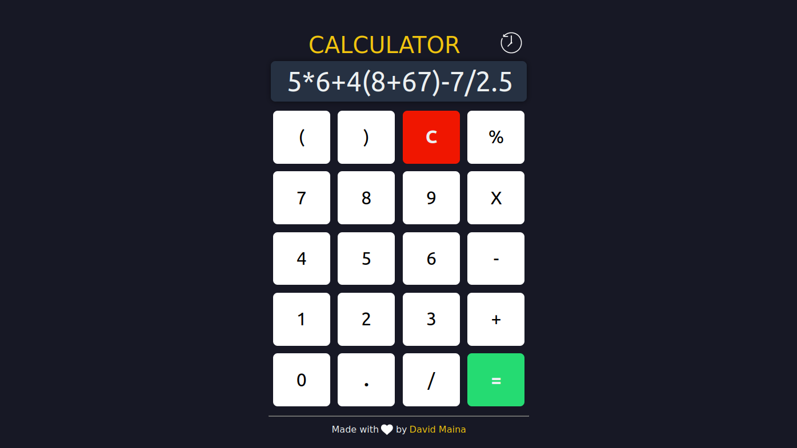

## JS Simple Calculator

A simple calculator web application built with HTML5, CSS, and JavaScript that provides basic arithmetic calculations.

## Features

- Perform addition, subtraction, multiplication, and division.
- Clear the input field with the "C" button.
- Calculate percentages.
- Responsive design for optimal viewing on various devices.
- History feature to keep track of previous calculations.

## Installation

1. Clone the repository: `git clone https://github.com/davymaish/calculator.git`
2. Open the project directory.
3. Open the `index.html` file in a web browser.

## Contributing

Contributions are welcome! If you find any issues or have ideas for improvements, please open an issue or submit a pull request.

## License

This project is licensed under the [MIT License](LICENSE).

## Contact

For any inquiries or feedback, feel free to contact me via:

- Website: [davymaish.github.io](https://davymaish.github.io)
- Email: [davymaish6@gmail.com](mailto:davymaish6@gmail.com)

